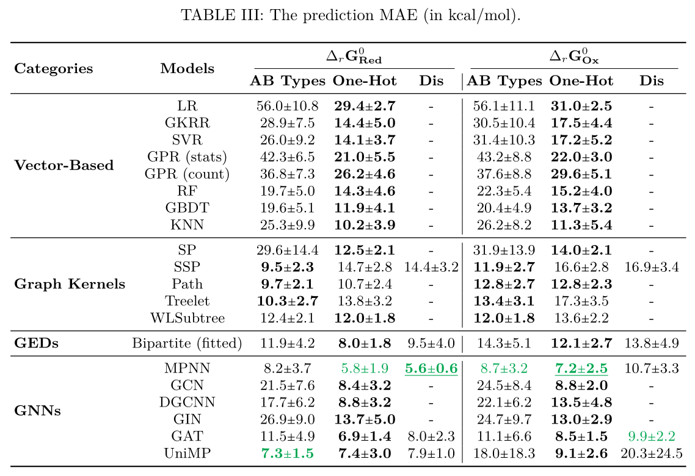

# RedoxPrediction

[//]: # ([![DOI]&#40;https://zenodo.org/badge/DOI/10.5281/zenodo.5560005.svg&#41;]&#40;https://doi.org/10.5281/zenodo.5560005&#41;)
[//]: # ([![ACPR 2023]&#40;https://img.shields.io/badge/ACPR-2023-blue&#41;]&#40;https://ericlab.org/acpr2023/&#41;)
[](https://chemrxiv.org/engage/chemrxiv/article-details/654bb7202c3c11ed71fc350b)

[](http://makeapullrequest.com)

[](https://github.com/jajupmochi/RedoxPrediction/archive/master.zip) 
[](https://twitter.com/intent/follow?screen_name=jajupmochi) 

The `RedoxPrediction` project is the code for the paper 
[Predicting Redox Potentials by Graph-Based Machine Learning Methods](whatwhat?) ([preprint](https://chemrxiv.org/engage/chemrxiv/article-details/654bb7202c3c11ed71fc350b)).

[//]: # (published in the proceedings of [ACPR 2023]&#40;https://ericlab.org/acpr2023/&#41;.)

## How to use?

### Prerequisites:

- Python version 3.8 or higher.

### Install the prerequisite libraries:

```
python3 -m pip install -r requirements.txt
git clone https://github.com/jajupmochi/graphkit-learn
cd graphkit-learn
python setup.py [develop] [--user]
```

If you want to run the GNN models on GPUs, NVIDIA GPU and driver is required. 
Check [this tutorial](https://zhuanlan.zhihu.com/p/634250809) for more information.

### Install the library

```
git clone git@github.com:jajupmochi/RedoxPrediction.git
cd RedoxPrediction/
python setup.py [develop] [--user]
```

### Run the code

```
python3 redox_prediction/models/run_xps.py
```

It is also possible to perform a specific experiment by appending arguments, e.g.,

```
python3 redox_prediction/models/run_xps.py --dataset brem_togn_dGred --model nn:mpnn --descriptor atom_bond_types
```
The experiments can also be performed on a High Performance Computer cluster with
SLURM installed, by simply running 
```
python3 redox_prediction/jobs/run_job.py
```
The outputs will be stored in the `redox_prediction/outputs/` directory.

## Data description

The details of the dataset can be found in the following repository:
[ORedOx159](https://github.com/ANRMoMoPlasm/ORedOx159).

Notice: in this project, the introduced dataset is also referred to by the name `Redox` or `brem_togn`.

## Model illustrations

### Descriptors


### Machine learning models


## Results gallery

### The prediction MAE

Results in terms of MAE, measured on the test sets. The "-" notation indicate that the method is not suitable for the descriptor:



### Correlations

Potentials computed by DFT vs the ones predicted via the best descriptor and model:


### Reference time

Reference time per datapoint for graph-based
models, in log-scaled with base 10, and in seconds:


## Authors

* [Linlin Jia](https://jajupmochi.github.io/), the PRG group, Institute of Computer Science, University of Bern
* [Éric Brémond](https://www.itodys.univ-paris-diderot.fr/fr/annuaire/chimie-theorique-et-modelisation-ctm/eric-bremond),  ITODYS, CNRS, Université Paris Cité
* [Larissa Zaida](https://www.linkedin.com/in/larissa-zaida-58b9631a4/?originalSubdomain=fr), ITODYS, CNRS, Université Paris Cité
* [Benoit Gaüzère](https://bgauzere.github.io/), the LITIS Lab, INSA Rouen Normandie
* [Vincent Tognetti](https://www.lab-cobra.fr/annuaire/tognetti-vincent/), the COBRA Lab, Normandie Université
* [ Laurent Joubert](https://www.lab-cobra.fr/annuaire/joubert-laurent/), the COBRA Lab, Normandie Université

## Citation

If you have used this library in your publication, please cite the following paper (coming soon):

```
```

## Acknowledgments

E.B. and L.Z. thank Dr. P.P. Lainé (ITODYS lab,
CNRS) for fruitful discussions regarding the construction
of the ORedOx159 database.

E.B. gratefully acknowledges ANR (Agence Nationale
de la Recherche) for the financial support of this work
through the MoMoPlasm project (ANR-21-CE29-0003).
He thanks also ANR and CGI (Commissariat à l’Investissement d’Avenir) for their financial support of this
research through Labex SEAM (Science and Engineering
for Advanced Materials and devices) ANR-10-LABX-096,
ANR-18-IDEX-0001, and acknowledges TGGC (Très
Grand Centre de Calcul du CEA) for computational resources allocation (Grant No. AD010810359R1).

This work has also been partially supported by University of Rouen Normandy, INSA Rouen Normandy,
the “Centre National de la Recherche Scientifique”
(CNRS), the European Regional Development Fund
(ERDF), Labex SynOrg (ANR-11-LABX-0029), Carnot
Institut I2C, the graduate school for research XL-Chem
(ANR-18-EURE-0020 XL CHEM), and the “Région Normandie”. The Centre Régional Informatique et d’Applications Numériques de Normandie (CRIANN) is acknowledged for providing access to computational resources to L.J., V.T. and L.J.
